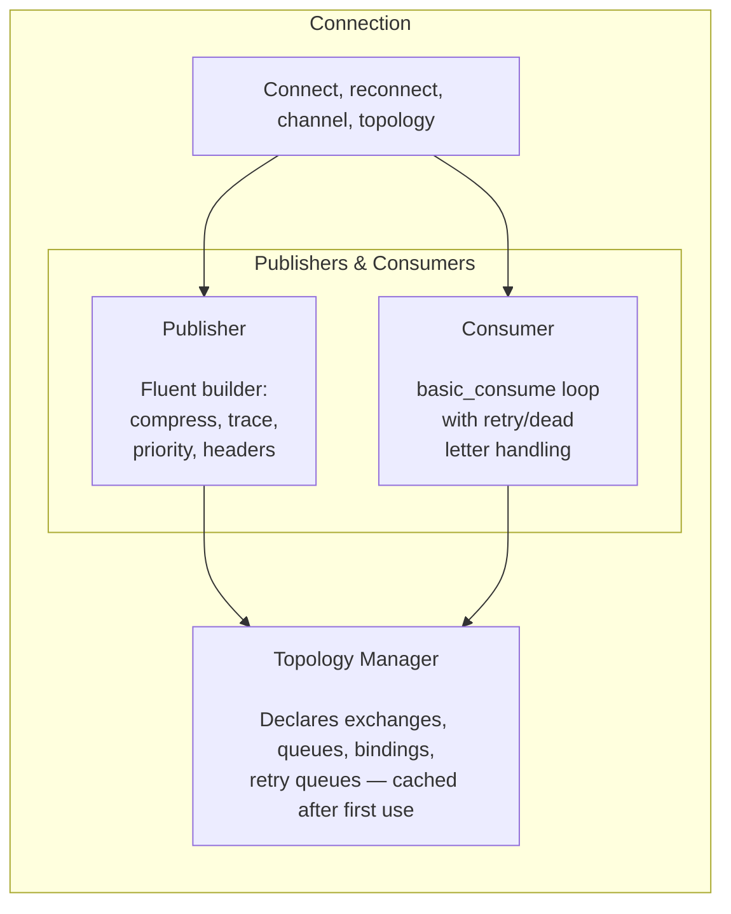

# phpdot/queue

RabbitMQ messaging for PHP: publish, consume, retry, dead letter.

## Install

```bash
composer require phpdot/queue
```

## Quick Start

```php
use PHPdot\Queue\Connection;
use PHPdot\Queue\Config\ConnectionConfig;
use PHPdot\Queue\Message;
use PHPdot\Queue\TaskStatus;

$config = new ConnectionConfig(
    host: 'localhost',
    exchanges: [
        'tasks' => ['type' => 'direct', 'durable' => true],
    ],
    queues: [
        'tasks.process' => [
            'bindings' => [['exchange' => 'tasks', 'routing_key' => 'task.new']],
            'durable' => true,
        ],
    ],
);

$conn = new Connection($config);

// Publish
$conn->message('{"task":"send_email"}')
    ->publish('tasks', 'task.new');

// Consume
$conn->consume('tasks.process')
    ->execute(function (Message $msg): TaskStatus {
        processTask(json_decode($msg->body(), true));
        return TaskStatus::SUCCESS;
    });
```

---

## Architecture



---

## Publishing

```php
// Simple
$conn->message('{"order_id": 123}')
    ->publish('orders', 'order.created');

// Full-featured
$conn->message(json_encode($data))
    ->retry(5)
    ->priority(8)
    ->compress()
    ->header(['traceparent' => $traceHeader])
    ->header(['x-source' => 'api-gateway'])
    ->publish('orders', 'order.created');
```

**Auto-set properties:**

| Property | Default |
|---|---|
| `message_id` | UUIDv7 |
| `timestamp` | `time()` |
| `app_id` | `gethostname()` |
| `content_type` | Auto-detected (JSON or text) |
| `delivery_mode` | 2 (persistent) |

---

## Consuming

```php
$conn->consume('orders.process')
    ->prefetch(10)
    ->onRetry(function (Message $msg, int $count): void {
        echo "Retry #{$count}: {$msg->messageId()}\n";
    })
    ->onDead(function (Message $msg, string $reason): void {
        echo "Dead: {$msg->messageId()} — {$reason}\n";
    })
    ->execute(function (Message $msg): TaskStatus {
        $data = json_decode($msg->body(), true);

        if ($data === null) {
            return TaskStatus::DEAD;     // malformed, don't retry
        }

        try {
            processOrder($data);
            return TaskStatus::SUCCESS;  // done
        } catch (TemporaryException $e) {
            return TaskStatus::RETRY;    // try again
        } catch (PermanentException $e) {
            return TaskStatus::DEAD;     // give up
        }
    });
```

Three return values. No ambiguity:

- **SUCCESS** — ack, done
- **RETRY** — nack to retry queue, try again later
- **DEAD** — ack + forward to dead letter exchange

Unhandled exceptions are caught and dead-lettered automatically. The consumer never crashes.

---

## Retry & Dead Letter

### Retry Flow

```
orders.queue
    │ nack
    ▼
orders.queue.retry.exchange
    │
    ▼
orders.queue.retry (TTL queue, e.g. 500ms)
    │ TTL expires
    ▼
orders.queue (message redelivered, retry count incremented)
```

Enable in config:

```php
'queues' => [
    'orders.process' => [
        'bindings' => [['exchange' => 'orders', 'routing_key' => 'order.created']],
        'retry' => ['enable' => true, 'delay' => 500],
        'dead' => 'dead-letters',
        'durable' => true,
    ],
],
```

Retry infrastructure (exchange, TTL queue, bindings) is created automatically on first use.

### Dead Letter

When max retries exceeded or `TaskStatus::DEAD` returned, the message is forwarded to the dead letter exchange with:

- `x-failed-queue` — original queue name
- `x-failed-reason` — failure description
- `x-failed-timestamp` — Unix timestamp

---

## Compression

```php
// Publish compressed
$conn->message($largePayload)
    ->compress()
    ->publish('data', 'import.batch');

// Consume — transparent decompression
$conn->consume('data.process')
    ->execute(function (Message $msg): TaskStatus {
        $body = $msg->body();  // already decompressed
        return TaskStatus::SUCCESS;
    });
```

---

## Trace Propagation

Pass trace context as plain string headers. No coupling to any tracing library.

```php
// Publish with trace
$conn->message($payload)
    ->header(['traceparent' => $tracelog->getTraceparent()->toHeader()])
    ->publish('orders', 'order.created');

// Consume with trace
$conn->consume('orders.process')
    ->execute(function (Message $msg): TaskStatus {
        $traceparent = $msg->header('traceparent');  // '' if missing
        // Reconnect trace in your framework layer
        return TaskStatus::SUCCESS;
    });
```

---

## Configuration

```php
$config = new ConnectionConfig(
    host: 'rabbitmq.internal',
    port: 5672,
    username: 'app',
    password: 'secret',
    vhost: '/',
    timeoutMs: 30000,
    maxRetries: 3,
    retryDelayMs: 1000,
    exchanges: [
        'orders' => ['type' => 'direct', 'durable' => true],
        'notifications' => ['type' => 'fanout', 'durable' => true],
        'dead' => ['type' => 'direct', 'durable' => true],
    ],
    queues: [
        'orders.process' => [
            'bindings' => [
                ['exchange' => 'orders', 'routing_key' => 'order.created'],
                ['exchange' => 'orders', 'routing_key' => 'order.updated'],
            ],
            'retry' => ['enable' => true, 'delay' => 500],
            'dead' => 'dead',
            'durable' => true,
        ],
    ],
);
```

---

## Connection Resilience

Auto-reconnect with exponential backoff:

```
Attempt 1: wait 1s
Attempt 2: wait 2s
Attempt 3: wait 4s
→ ConnectionException if all fail
```

---

## Message API

```php
$msg->body();              // message content (decompressed)
$msg->messageId();         // UUIDv7 message ID
$msg->queue();             // queue name
$msg->header('key');       // header value or ''
$msg->headers();           // all headers as array
$msg->maxRetries();        // x-retries-max value
$msg->priority();          // 0-10
$msg->originalExchange();  // x-original-exchange
$msg->originalRoutingKey();// x-original-routing-key
$msg->failedReason();      // x-failed-reason (on dead letters)
```

---

## Package Structure

```
src/
├── Connection.php          Main entry point
├── Publisher.php            Fluent message builder
├── Consumer.php             Message consumer with retry/dead letter
├── Message.php              Immutable inbound message DTO
├── TaskStatus.php           SUCCESS, RETRY, DEAD
├── Config/
│   └── ConnectionConfig.php Connection and topology configuration
├── Topology/
│   └── TopologyManager.php  Exchange/queue/binding declaration
└── Exception/
    ├── QueueException.php   Base exception
    ├── ConnectionException.php
    ├── PublishException.php
    └── ConsumeException.php
```

---

## Development

```bash
composer test        # PHPUnit (unit tests only)
composer test-all    # PHPUnit (including integration, needs RabbitMQ)
composer analyse     # PHPStan level 10
composer cs-fix      # PHP-CS-Fixer
composer check       # All three (unit + analyse + cs-check)
```

## License

MIT
